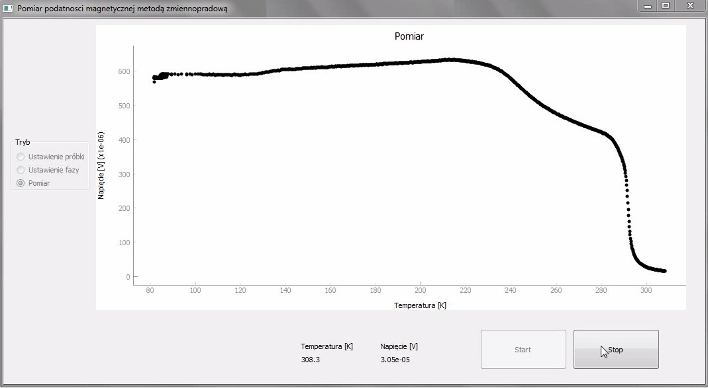
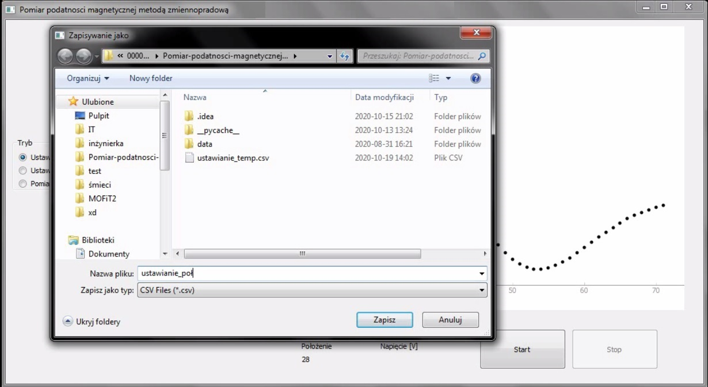
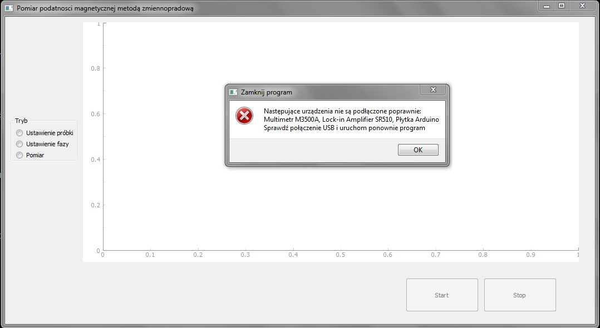
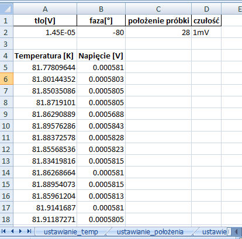

# Pomiar-podatnosci-magnetycznej-metoda-zmiennopradowa
Projekt w trakcie budowy

Celem projektu jest przygotowanie oprogramowania do pomiaru podatności magnetycznej metodą zmiennoprądową.
Projekt obsługuje 3 urządzenia:
- silnik krokowy - ustawianie próbki w środku cewki helmholtza
- woltomierz homodynowy (lock-in amplifier) SR510
- multimetr Picotest M3500A - pomiar temperatury za pomocą termopary Cu-konstantan

Użyte technologie:
 - Python 3.7 (minimum - osobna wersja dla 3.4 pojawi się wktótce)
 - PyQt 5
 - pyserial
 - pyvisa
 - pathlib
 - pandas
 
 Wygląd programu:
 - pomiar (tu: próbka gadolinu):
  
 
 - zapis do pliku:
  
 
 - problemy z podłączeniem:
  
 
 - tak wygląda zapisany plik w formacie .xlms:
 
  